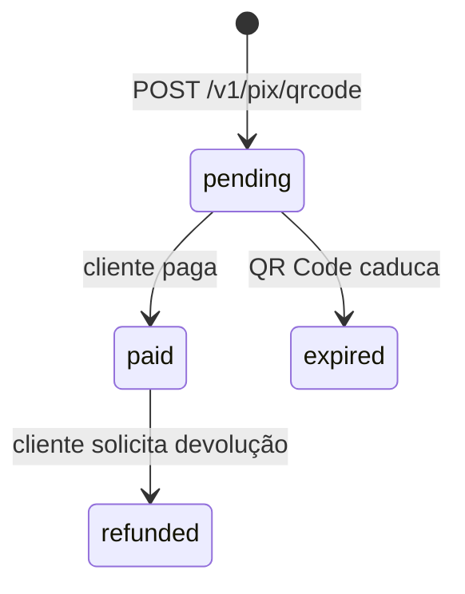
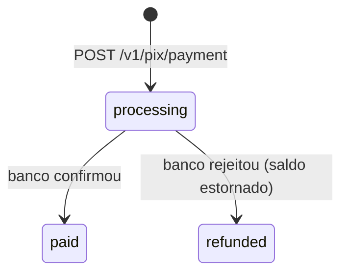

## Cash-in (recebimento)

**Estados:**

| Status | Final? | Significado |
|---|---|---|
| `pending` | ❌ | QR Code gerado, aguardando pagamento. |
| `paid` | ✅ | Cliente pagou. Saldo creditado. |
| `expired` | ✅ | QR Code expirou sem pagamento. |
| `refunded` | ✅ | Devolução pós-pagamento. Saldo estornado. |

## Cash-out (pagamento)

**Estados:**

| Status | Final? | Significado |
|---|---|---|
| `processing` | ❌ | Pagamento enviado, aguardando confirmação do banco do destinatário. |
| `paid` | ✅ | Banco confirmou. Pagamento concluído. |
| `refunded` | ✅ | Não foi possível concluir (ex: chave inválida no banco do destinatário). **Saldo é estornado automaticamente.** |
| `failed` | ✅ | Rejeitado na validação inicial (saldo insuficiente, dados inválidos). Nenhum valor é movimentado. |

## Idempotência

Use `external_id` como identificador único da sua transação. Se você enviar a mesma cobrança 2x com o mesmo `external_id`:

- Se a primeira ainda está `pending`/`processing`/`paid` → retornamos erro `409 Conflict` (ou `401` com mensagem específica em endpoints legados).
- Se a primeira está `failed` → permitimos retentar com mesmo `external_id`.

<Tip>
Use UUIDs ou IDs únicos do seu sistema (`pedido-001`, `withdrawal-abc123`) — nunca timestamps puros (que podem colidir em alta concorrência).
</Tip>
